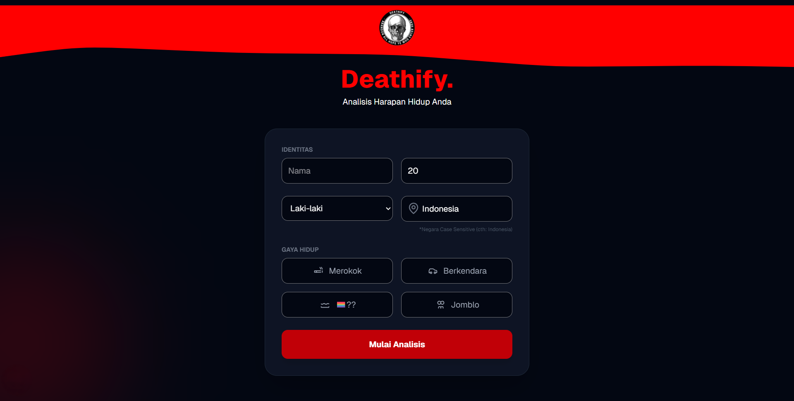
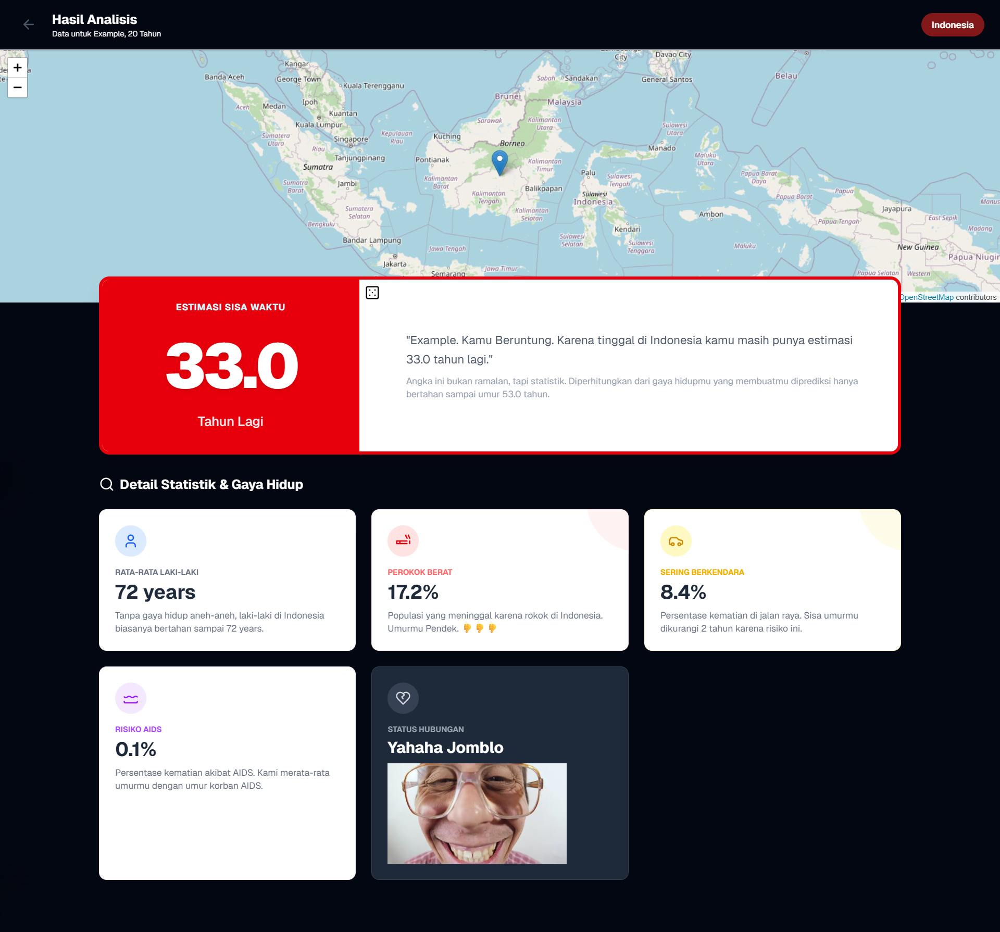

# 💀 Deathify - Statistics-Based Life Expectancy Analysis

Deathify is an interactive web application that calculates an estimation of a person's remaining lifespan based on national demographic statistical data and various user lifestyle variables. This project utilizes database integration to present accurate life expectancy data based on geographical location.




## 🚀 Key Features

* **Identity & Demographics:** Input data for name, age, gender, and country location (Case Sensitive) as the foundation for life expectancy figures.
* **Lifestyle Variables:** Customizable risk factors, such as smoking habits, driving intensity, and relationship status.
* **Analysis Results Dashboard:**
    * **Estimated Remaining Time:** Displays the predicted remaining years of life in a large, prominent format.
    * **Statistical & Risk Details:** In-depth explanations regarding the impact of each variable, such as the percentage of death risk from smoking or road accidents.
    * **Geo-Statistical Map:** Real-time visualization of the user's location on a world map.
* **Database Integrated:** Fetches country-specific data (average age of death, disease risks, etc.) directly from the database collection.
* **Re-Roll:** Not satisfied with your remaining time? Is it too low? Just Re-Roll and good luck.

## 🛠 Tech Stack

* **Frontend:** HTML5, CSS3 (Glassmorphism UI), JavaScript.
* **Styling:** Tailwind CSS.
* **Database:** Google Firebase / Firestore.
* **Maps API:** OpenStreetMap / Leaflet.

## ⚙️ How to Run Locally
If you want to run this website locally, or create a similar website, follow these steps:

### 1. Database Preparation
This application requires a database (Firestore) / MongoDB with a specific data structure to function. Using Firebase, follow these steps:

1.  Create a new project in the **Google Firebase Console**.
2.  Enable **Firestore Database**.
3.  Create a primary collection named `countries`.
4.  Gather mortality data for each country / only the countries you wish to include (you can use WHO or IHME data).
5.  Add documents for each country (e.g., `American Samoa`) to the database with the following field structure:
    * `DeathAge`: (string) e.g., "72 years"
    * `DeathM` / `DeathF`: (string) Average mortality for males/females.
    * `DeathSmoke` / `DeathRoad` / `DeathAIDS_Pct`: (string) Percentage of death risk.
    * `AvgAge_Smoke` / `AvgAge_Road` / `AvgAge_AIDS`: (string) Average age of death in related cases.
    * `Lat` / `Lon`: (number) Country geographical coordinates.

> **Note:** Ensure field naming matches the database structure screenshot provided in the technical documents folder so the application can map data correctly.

### 2. Installation & Execution
1.  **Clone this repository:**
    ```bash
    git clone [https://github.com/username/deathify.git](https://github.com/username/deathify.git)
    cd deathify
    ```
2.  **API Configuration:**
    Open your database configuration file (e.g., `firebase-config.js`) and enter the credentials for the Firebase project you created.
3.  **Run the application:**
    Enter in your terminal:
    ```bash
    npm run dev
    ```
    * The application will run at `http://localhost:3000`.

## 📋 Usage
1.  Enter your name and age.
2.  Enter the country name exactly as it appears in the database (e.g., **Indonesia** or **American Samoa**).
3.  Select your lifestyle options in the available columns.
4.  Click **"Start Analysis"** to see the statistical calculation results.
5.  Click the **"Dice Logo"** next to the calculated result to randomize the outcome.

---
*Disclaimer: This application uses calculations based on global statistical averages for educational and entertainment purposes. It is not a medical forecast or a certainty of an individual's remaining lifespan.*
